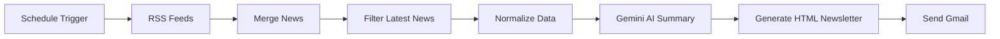

# 📰 Tamil News Daily Automation

<div align="center">


<br><br>

# ✨ AI-Powered Tamil Newspaper Automation

### Fully Automated Tamil News Newsletter using n8n + Gemini AI

🚀 Fetches Latest Tamil News → Generates AI Summaries → Creates Premium HTML Newsletter → Sends Email Automatically

</div>

---

# 📌 Overview

This project is an advanced **AI-powered Tamil News Automation Workflow** built using [n8n](https://n8n.io?utm_source=chatgpt.com) and [Google Gemini AI](https://ai.google.dev?utm_source=chatgpt.com).

The workflow automatically:

✅ Collects trending Tamil news from Google RSS feeds
✅ Filters latest breaking news from last 24 hours
✅ Removes duplicate headlines
✅ Uses Gemini AI to generate Tamil summaries
✅ Builds a modern newspaper-style HTML newsletter
✅ Sends the newsletter directly to Gmail
✅ Runs automatically every morning at 6 AM

---

# 🎯 Features

✨ AI-generated Tamil summaries
✨ Beautiful newspaper-style email UI
✨ Fully automated workflow
✨ Dynamic Tamil date system
✨ Smart duplicate news filtering
✨ Trending tags section
✨ Responsive newsletter design
✨ Multiple news categories
✨ Scheduled execution
✨ Gmail integration
✨ Modern UI/UX inspired layout

---

# 🧠 Workflow Architecture



---

# 📰 News Categories Included

| Category        | Source     |
| --------------- | ---------- |
| Tamil Nadu News | Google RSS |
| Tamil Politics  | Google RSS |
| Tamil Sports    | Google RSS |
| Breaking News   | Google RSS |

---

# 🤖 AI Features

The workflow uses Gemini AI to:

* Generate Tamil summaries
* Convert English headlines into Tamil
* Maintain summary consistency
* Produce clean JSON outputs
* Generate readable content for newsletters

---

# 🎨 UI/UX Highlights

## Newspaper Style Design

* Premium magazine layout
* Gradient headers
* Tamil typography
* Dynamic sections
* Trending news sidebar
* Modern card-based design

## Responsive Newsletter

✔ Desktop Friendly
✔ Mobile Friendly
✔ Email Client Compatible

---

# ⚙️ Technologies Used

| Technology       | Purpose             |
| ---------------- | ------------------- |
| n8n              | Workflow Automation |
| Google Gemini AI | AI Summarization    |
| Gmail API        | Email Sending       |
| HTML/CSS         | Newsletter UI       |
| JavaScript       | Data Processing     |
| Google RSS       | News Source         |

---

# 📂 Workflow File

📄 Uploaded Workflow JSON: 

---

# 🚀 Setup Instructions

## 1️⃣ Clone Repository

```bash
git clone https://github.com/your-username/tamil-news-automation.git
```

---

## 2️⃣ Install n8n

```bash
npm install n8n -g
```

---

## 3️⃣ Start n8n

```bash
n8n start
```

---

## 4️⃣ Import Workflow

1. Open n8n dashboard
2. Click **Import Workflow**
3. Upload `Tamil_NewsPaper_Automation.json`

---

## 5️⃣ Configure Credentials

### Gmail OAuth2

Add:

* Gmail Account
* OAuth Credentials

### Gemini API

Add:

* Google Gemini API Key

Get API Key from:

[Google AI Studio](https://aistudio.google.com?utm_source=chatgpt.com)

---

# 📧 Email Newsletter Preview

## Includes:

✅ Hero Headline
✅ AI Summary
✅ Trending Sidebar
✅ Tamil Dates
✅ Dynamic Tags
✅ Footer Branding

---

# 🕒 Automation Schedule

| Time    | Action           |
| ------- | ---------------- |
| 6:00 AM | Fetch News       |
| 6:01 AM | AI Summarization |
| 6:02 AM | Generate HTML    |
| 6:03 AM | Send Newsletter  |

---

# 📸 Screenshots

## Workflow Automation


---

# 🔥 Advanced Features

## Smart Filtering

* Removes duplicate headlines
* Filters only latest 24-hour news
* Sorts by recency

## AI Summarization

* Generates 2–3 sentence Tamil summaries
* Converts English → Tamil
* Maintains natural language flow

## Dynamic HTML Generation

* Tamil typography
* Responsive layout
* Animated gradients
* Dynamic sections

---

# 💡 Future Improvements

* Telegram Integration
* WhatsApp News Delivery
* Voice News Summary
* AI News Categorization
* Personalized News Feed
* Mobile App Integration

---

# 🛡️ Error Handling

✔ Invalid URLs handled
✔ Missing summaries handled
✔ Duplicate news prevention
✔ AI response validation

---

# 📈 Use Cases

✅ Daily Tamil Newspaper
✅ News Agency Automation
✅ AI Newsletter Platform
✅ Tamil Content Automation
✅ Media Tech Projects
✅ Hackathon Projects

---

# 🏆 Perfect For

* AI Hackathons
* Automation Competitions
* n8n Challenges
* Portfolio Projects
* AI Workflow Showcases

---

# 👨‍💻 Author

## Kanishkar R

🎓 CSE Student
💻 Web Developer
🤖 AI & Automation Enthusiast

---

# 🌟 Support

If you like this project:

⭐ Star the repository
🍴 Fork the project
🚀 Share with others

---

# 📜 License

This project is licensed under the MIT License.

---

<div align="center">

# 🚀 Built with AI + Automation + Tamil ❤️

### “Automating Tamil News using AI-powered workflows”

</div>
